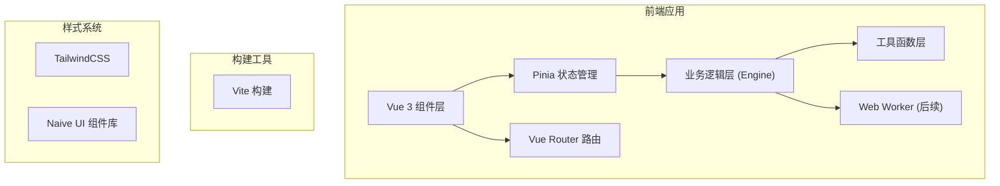

# 序列比对工具 技术架构文档 (Milestone 1)

## 1. 架构设计



## 2. 技术描述

- 前端框架：Vue 3 + TypeScript + Vite
- 状态管理：Pinia
- 路由管理：Vue Router (hash 模式)
- UI 组件库：Naive UI
- 样式方案：TailwindCSS
- 部署目标：GitHub Pages
- PWA 支持：Milestone 8 实现

### 目录结构
```
src/
├── components/
│   ├── common/          # 通用组件
│   ├── input/           # 输入序列模块
│   ├── preprocess/      # 序列预处理模块
│   ├── analysis/        # 分析设置模块
│   └── result/          # 结果展示模块
├── engine/
│   ├── parser/          # 序列解析器
│   ├── preprocess/      # 预处理逻辑
│   ├── align/           # 比对算法
│   ├── scheduler/       # 任务调度
│   ├── worker/          # Web Worker
│   └── cache/           # 缓存
├── stores/              # Pinia 状态管理
├── types/               # TypeScript 类型定义
├── utils/               # 工具函数
├── workers/             # Worker 入口
├── assets/              # 静态资源
├── router/              # 路由配置
├── App.vue
└── main.ts
```

## 3. 路由定义

| 路由 | 用途 |
|------|------|
| / | 主应用页面（包含所有模块区域） |

说明：Milestone 1 阶段采用单页布局，所有模块在同一页面纵向排列。

## 4. 状态管理 (Pinia Stores)

| Store 名称 | 用途 | 核心字段 |
|------------|------|----------|
| referenceStore | Reference 序列管理 | sequences, stats |
| queryStore | Query 序列管理 | sequences, stats |
| settingsStore | 全局设置 | theme, alignParams |
| resultStore | 比对结果 | results, filters |
| progressStore | 进度状态 | currentTask, percent, status |
| uiStore | UI 状态 | activeSection, expandedPanels |

## 5. 数据模型

### 5.1 序列数据模型
```typescript
interface Sequence {
  id: string;
  name: string;
  sequence: string;
  type: 'dna' | 'rna';
  length: number;
  gcContent: number;
  source: 'file' | 'paste' | 'text';
  fileName?: string;
  createdAt: number;
}

interface SequenceStats {
  count: number;
  totalLength: number;
  avgLength: number;
  gcContent: number;
  type: 'dna' | 'rna' | 'mixed';
}
```

### 5.2 比对结果模型
```typescript
interface AlignmentResult {
  id: string;
  referenceId: string;
  queryId: string;
  identity: number;
  score: number;
  method: 'sliding' | 'local' | 'global';
  alignment: {
    refStart: number;
    refEnd: number;
    queryStart: number;
    queryEnd: number;
    refSeq: string;
    querySeq: string;
    matchLine: string;
  };
}
```

## 6. 主题系统

- 支持深色 / 浅色两种主题
- 使用 Naive UI 内置主题系统 + TailwindCSS 深色模式
- 主题状态持久化到 localStorage
- CSS 变量统一管理颜色
